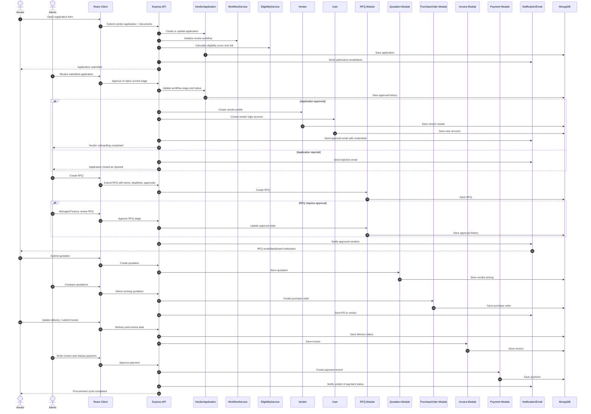
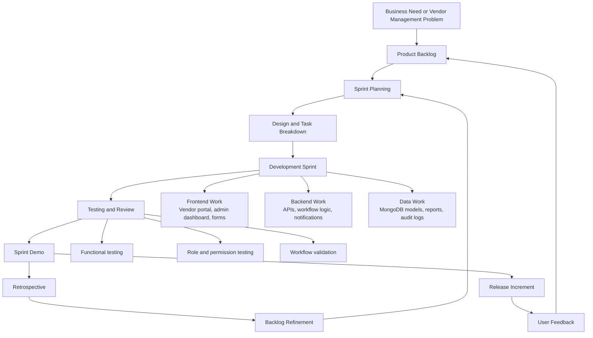
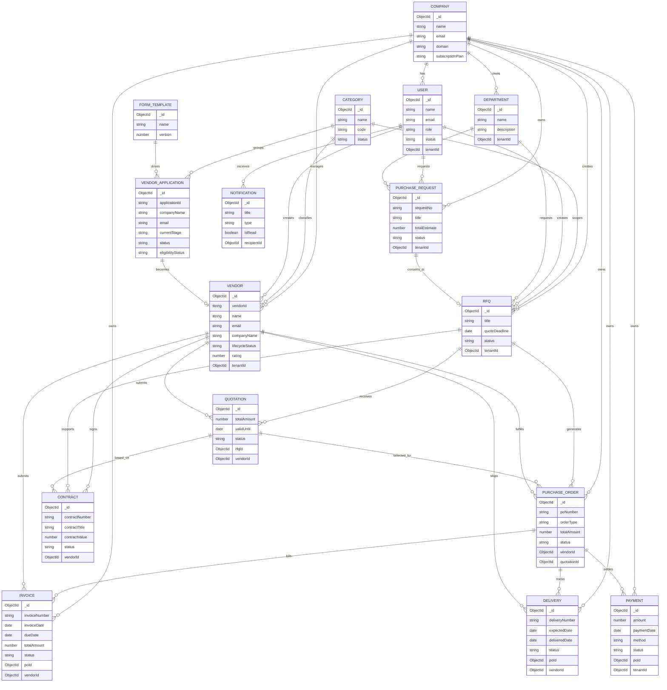
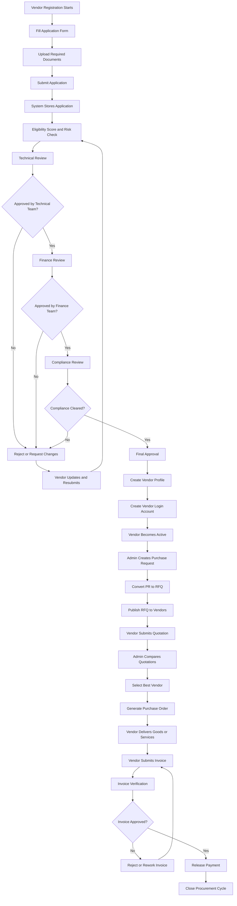

# Vendor Management System Diagrams

These diagrams are based on the current project structure in the `client/` and `server/` applications, especially the onboarding, RFQ, quotation, purchase order, delivery, invoice, and payment modules.

## 1. Sequence Diagram

## 2. Agile Model

### Agile approach for this project

- `Sprint 1`: authentication, roles, vendor registration, form templates
- `Sprint 2`: application review workflow, approval stages, notifications
- `Sprint 3`: RFQ, quotation, vendor selection, purchase order generation
- `Sprint 4`: delivery tracking, invoice processing, payment monitoring, audit analytics
- `Continuous`: bug fixing, UI polish, security, performance, and reporting improvements

## 3. ER Diagram

## Notes

- The onboarding flow comes from `VendorApplication`, `WorkflowService`, `EligibilityService`, `Vendor`, and `User`.
- The procurement flow comes from `PurchaseRequest`, `RFQ`, `Quotation`, `PurchaseOrder`, `Delivery`, `Invoice`, and `Payment`.
- The system is multi-tenant, so `tenantId` links many records back to `Company`.

## 4. Process Diagram

